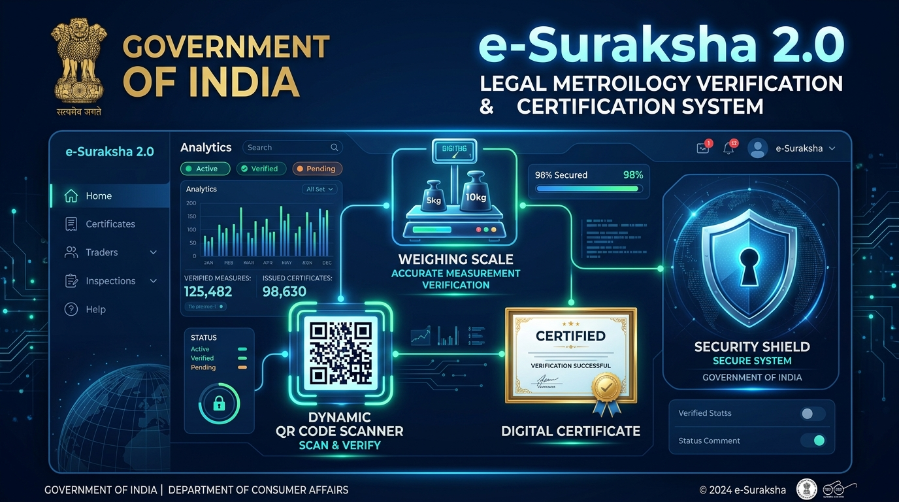
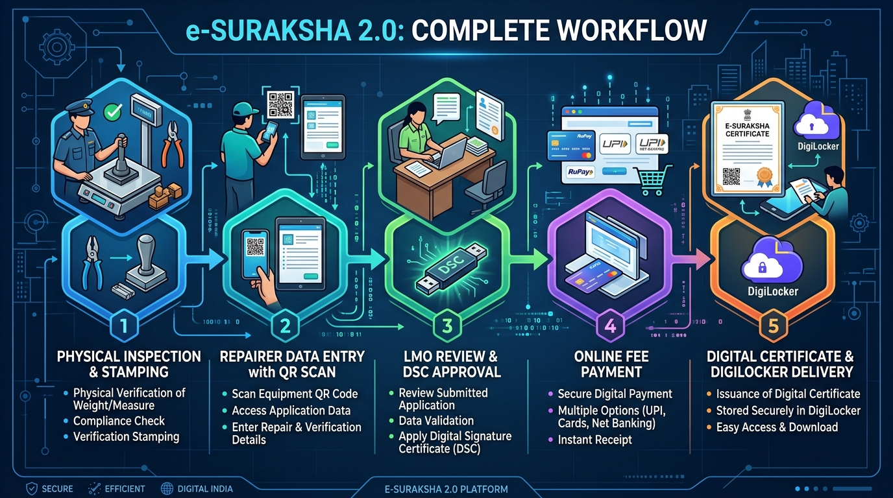

# e-Suraksha 2.0 (SIH 26036)

> **A Unified Digital Platform for Legal Metrology Verification, Certification, and Lifecycle Management**  
> *Implemented under the Legal Metrology Act, 2009 & Legal Metrology (General) Rules, 2011*  
> **Submitted for Smart India Hackathon 2026 (SIH 26036)**

---



---

## 🎯 Executive Summary & Problem Statement

Under the **Legal Metrology Act, 2009**, every weighing and measuring instrument used in trade, transaction, or commercial protection is required to be periodically verified and stamped. The legacy process involved paper-based manual record-keeping, physical file movement, lack of public verification traceability, and missed renewal deadlines.

**e-Suraksha 2.0** digitizes the complete end-to-end verification lifecycle:
- **UDII (Unified Digital Identity for Instruments)**: Provides a permanent lifetime digital identity for every machine (`YYMMDD-DOB_DDMM-SEQ_6-CHECK`).
- **Role-Based QR Scanning System**: Custom views for Shopkeepers, Licensed Repairers, LMO Officers, and Consumers.
- **Repairer 30-Day Auto-Fill Module**: Scans QR codes and auto-populates all machine specifications from the previous verification record.
- **LMO Mobile Verification & DSC Digital Signing**: Digital observation entry, MPE (Maximum Permissible Error) pass/fail calculation, and PKI Class-3 Digital Signature Certificate stamping.
- **DigiLocker Integration Pipeline**: Automatic push of tamper-proof PDF verification certificates into citizens' DigiLocker wallets.
- **Smart Consumer Grievance System**: Public QR-linked complaint filing with geotagging and a 7-day auto-escalation timeline.

---

## 🔄 Complete System Workflow Architecture



### Workflow Phases:
1. **Physical Inspection & Stamping (Field)**: LMO Officer & Licensed Repairer inspect machine accuracy against MPE standards and apply physical seals.
2. **Repairer QR Auto-Fill & Submission**: Repairer scans machine QR code, uploads technician report, seal-break permission letter, and geotagged photos.
3. **LMO Review & Digital Signature (DSC)**: Assigned Legal Metrology Officer reviews observations, records accuracy errors, applies Class-3 DSC digital signature, and approves.
4. **Online Fee Payment**: Shopkeeper receives instant SMS/Email notification and pays itemized statutory fees (Base fee + 5% statutory + 30% late fee if expired + 18% GST) via UPI/Net Banking/Cards.
5. **Certificate Delivery & DigiLocker Push**: System generates tamper-proof PDF verification certificate with QR code and pushes it to DigiLocker and SMS/Email download links.

---

## ✨ Key Features by Stakeholder Role

| Stakeholder Role | Key Capabilities & Features |
| :--- | :--- |
| **🏪 Shopkeeper (Business Owner)** | Business Scanner overview with color-coded status badges (🔴 Expired, 🟠 Expiring Soon &lt;30d, 🟡 Plan Ahead 30-60d, 🟢 Valid &gt;60d), Single & Multi-Machine Bulk Renewal Payment, Add New Machine with instant UDII generation, Download Digital Certificates. |
| **🔧 Licensed Repairer** | QR Code Auto-Fill (populates all last verification fields in 1 click), Upload technician report (PDF), Upload seal break permission, Upload geotagged photos with GPS coordinates, Submit directly to LMO. |
| **⚖️ LMO (Legal Metrology Officer)** | Pending application inspection queue, Record MPE accuracy test observations (Pass/Fail), Digital Signature Certificate (DSC) cryptographic signing, Approve & enable payment or Reject with official reasons, Urgent expiry alert dashboard. |
| **🔍 Consumer / Public** | Scan sticker QR code to instantly check machine authenticity (VERIFIED & VALID vs EXPIRED), View shop & instrument details, File QR-linked complaints for short-weighing with photos/videos & GPS geotagging, Live courier-style grievance tracker. |
| **🏛️ State Administrator** | High-level directorate analytics, Total verifications & fee collection metrics, Interactive UDII Luhn generator tool, DigiLocker API JSON/Base64 push simulator (`api.digilocker.gov.in/v1/issue`). |

---

## 🧮 UDII Generation Algorithm

Every machine is assigned a **Unified Digital Identity for Instruments (UDII)** that remains constant across renewals, ownership transfers, and repairs.

```
UDII = [YYMMDD] + "-" + [DOB_DDMM] + "-" + [SEQ_6] + "-" + [CHECK]
Example: 260828-1505-004567-3
```

- `YYMMDD`: Date of first registration (e.g. `260828` for 28-Aug-2026)
- `DOB_DDMM`: Last 4 digits of owner's Date of Birth (e.g. `1505` for 15-May)
- `SEQ_6`: Global atomic counter (6 digits, e.g. `004567`)
- `CHECK`: Luhn algorithm variant check digit for instant mathematical validation.

---

## 💰 Fee Structure (Legal Metrology Rules 2011)

The system automatically calculates itemized fees based on instrument category and denomination:
- **Base Verification Fee**: Varying by type (Weighing scales: ₹100–₹500, Storage tanks: ₹500–₹1500, Tank lorries: ₹1000).
- **Statutory Compliance Fee**: 5% of base fee.
- **Late Penalty Fee**: 30% of base fee (if expired).
- **GST**: 18% on subtotal.

---

## 🛠️ Technology Stack

- **Frontend Core**: React 18, TypeScript, Vite
- **Styling**: Tailwind CSS v4, Custom animations & Print CSS styling
- **Icons & Visuals**: Lucide React Icons
- **QR Code Engine**: `qrcode.react` (SVG / Canvas rendering)
- **Delight Effects**: `canvas-confetti`
- **State Management & Persistence**: LocalStorage DataStore API

---

## 🚀 Local Installation & Run Guide

### Prerequisites
- **Node.js**: v18.x or higher
- **NPM**: v9.x or higher

### Steps

1. **Clone the Repository**:
   ```bash
   git clone https://github.com/AbdulRazak5764/Project-E-Suraksha.git
   cd Project-E-Suraksha
   ```

2. **Install Dependencies**:
   ```bash
   npm install
   ```

3. **Run Local Development Server**:
   ```bash
   npm run dev
   ```
   Open your browser at `http://localhost:5173/` or `http://localhost:5175/`.

4. **Build Production Bundle**:
   ```bash
   npm run build
   ```

---

## 📜 License

Implemented under the **Legal Metrology Act, 2009**. Submitted for **Smart India Hackathon 2026 (SIH 26036)**.
